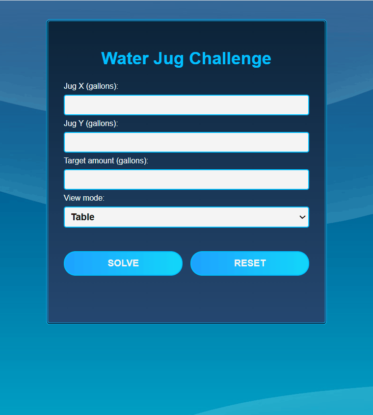

# Water Jug Challenge

This project is a solution to the classic **Water Jug Problem**, built with **HTML, CSS, and JavaScript (vanilla)**. Users can input two jug capacities (X and Y, in gallons) and a target amount (Z) to find the optimal way to measure exactly Z gallons.



---

## How to Run

1. Clone or download this repository.
2. Open `index.html` in your browser — no build tools or installations required.
3. Enter values for Jug X, Jug Y, and the target Z.
4. Select your preferred view mode: **Visual** or **Table**.
5. Click **Solve** to generate the steps.
6. If you selected **Visual**, click **Next Step** to progress through each action.

---

## Features

- Input validation for positive gallon values
- Visual step-by-step jug animations
- Tabular view of the solution steps
- **Dynamic toggle between visual and table mode**
- **Stylish and thematic UI** with custom colors and a water-themed background
- **Success message in green** for better visual feedback
- **Reset button** clears inputs and state without reloading the page
- Fully responsive and accessible

---

## Test Cases for Validation

Below are some test cases with expected outcomes to validate the solution logic:

| Jug X | Jug Y | Target Z | Expected Result |
|-------|-------|-----------|-----------------|
| 3     | 5     | 4         | ✅ Solvable      |
| 2     | 6     | 5         | ❌ Not solvable  |
| 8     | 12    | 4         | ✅ Solvable      |
| 1     | 2     | 3         | ✅ Solvable      |
| 7     | 9     | 8         | ❌ Not solvable  |

The algorithm checks whether Z is a multiple of GCD(X, Y) and less than or equal to the maximum of X or Y.

---

## Algorithm Overview

The algorithm uses the mathematical concept of the **Greatest Common Divisor (GCD)**. A solution is only possible if:

```
Z ≤ max(X, Y) AND Z % GCD(X, Y) === 0
```

It simulates two possible approaches (starting with Jug X or Jug Y) and returns the shortest one.

Allowed actions:
- Fill a jug
- Empty a jug
- Transfer contents between jugs

Each action updates the state and is recorded in the output sequence.

---

## Live Demo

You can try the app live here: [https://water-jug-challenge.netlify.app](https://water-jug-challenge.netlify.app)

## Personal Note

I really enjoyed this challenge and had fun exploring different designs and interaction ideas. In addition to the requirements, I added a **visual mode** to make the experience more engaging and playful. It was a great opportunity to practice both logic and UI skills.

---

## File Structure

```
├── index.html          # Main HTML layout
├── style.css           # Styling and jug visuals
├── script.js           # Core logic and interactivity
├── /water-bg.jpg       # Background image
├── preview.gif      # Preview screenshot for README
```

---

## Author

**Laura Moyano**  
Frontend Developer | UI/UX Enthusiast | Web Technologist

---

## License

MIT — Free to use, modify, and share.

